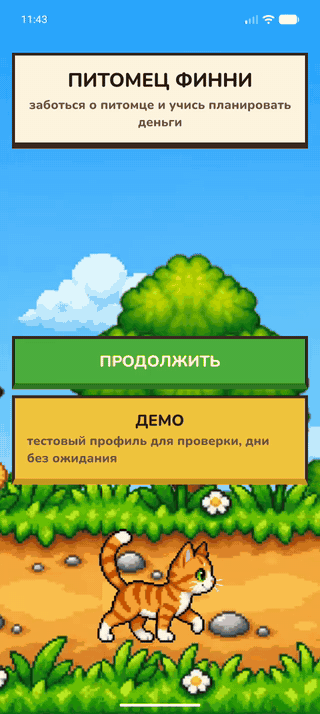
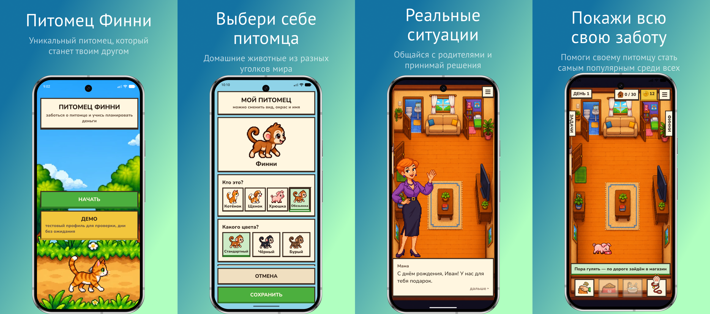

# Питомец Финни — кейс 6

<p align="center">
  
</p>

<p align="center">
  
</p>

Мобильная игра для детей 7–11 лет: ребёнок заботится о питомце и каждый день
распределяет монеты на обязательное, развлечения и копилку.

ЛЦТ 2026, задача Департамента финансов города Москвы.

## Состав Репозитория

| Путь | Что это |
| --- | --- |
| `README.md` | Readme |
| [`Документация.docx`](Документация.docx), [`Документация.pdf`](Документация.pdf) | Документация — пп. 1–12 раздела 5 ТЗ |
| [`Презентация.pdf`](Презентация.pdf), [`Презентация.pptx`](Презентация.pptx) | Презентация |
| [`Прототип.apk`](Прототип.apk) | Прототип — подписанный релизный APK |
| [`code/`](code) | исходный код (React Native, TypeScript, Feature-Sliced Design) |
| [`code/store/`](code/store) | иконка и скриншоты для RuStore |

## Быстрый запуск

| | |
| --- | --- |
| Файл | `Прототип.apk` |
| Пакет | `com.gov.mobile.pet` |
| Версия | 1.0.0 (versionCode 1) |
| Android | 7.0+ (API 24), `arm64-v8a`, `armeabi-v7a` |
| Разрешения | пользовательских нет, работает без интернета |

1. Скопировать `Прототип.apk` на телефон и открыть; либо `adb install Прототип.apk`.
2. Запустить «Питомец Финни».

## Демонстрационный сценарий

1. Главный экран → «ДЕМО» (отдельный профиль, каждый раз с нуля).
2. Имя можно не вводить — подставится «Иван».
3. Создать питомца: вид, окрас, кличка.
4. Разложить монеты на Обязательное, Развлечения, Копилку → «ГОТОВО».
5. Выполнить дела дня, зайти в магазин, выбрать цель в копилке.
6. Вкладка «ДЕМО» слева → «ДЕНЬ ▸»: день проживается целиком.
7. Повторять «ДЕНЬ ▸»: уроки дней 2–16, рост питомца, покупка цели.
8. «СБРОС» → «ДА» — возврат на главный экран.

## Сборка

| Инструмент | Версия |
| --- | --- |
| Node.js | 23.3.0 (≥ 22.11.0) |
| Yarn | 3.6.4 (в репозитории) |
| JDK | 21 |
| Android SDK Build-Tools / NDK | 37.0.0 / 27.1.12297006 |
| compileSdk / targetSdk / minSdk | 37 / 36 / 24 |

```bash
cd code
yarn install
cd android && ./gradlew assembleRelease
# → code/android/app/build/outputs/apk/release/app-release.apk
```

Релизная подпись — `code/android/keystore.properties` (в репозиторий не входит).
Без него APK подписывается отладочным ключом.

## Проверка

```bash
cd code
yarn tsc --noEmit   # типы
yarn jest           # 582 теста
yarn lint
```

## Где что в Документации

| Пункт 5 ТЗ | Раздел |
| --- | --- |
| 1. README: назначение, состав, запуск | 1 |
| 2. APK, окружение, сборка | 2 |
| 3. Архитектура | 3 |
| 4. Структура данных | 4 |
| 5. Матрица соответствия | 5 |
| 6. Формулы | 6 |
| 7. Карта образовательного контента | 7 |
| 8. UX/UI и доступность | 8 |
| 9. Разрешения, данные, удаление профиля | 9 |
| 10. Тест-кейсы и отчёт о проверке | 10 |
| 11. Ограничения и план развития | 11 |
| 12. Лицензии | 12 |
| Карточка RuStore | Приложение А |

## Лицензии

| Что | Лицензия |
| --- | --- |
| React, React Native, Reanimated, Gesture Handler, Worklets, MMKV, Nitro Modules, Safe Area Context | MIT |
| Шрифт NunitoGame (производный от Nunito) | SIL OFL 1.1 |
| Изображения | созданы для проекта, OpenAI `gpt-image-2` |
| Звук | не используется |

Полный перечень — раздел 12 Документации.
